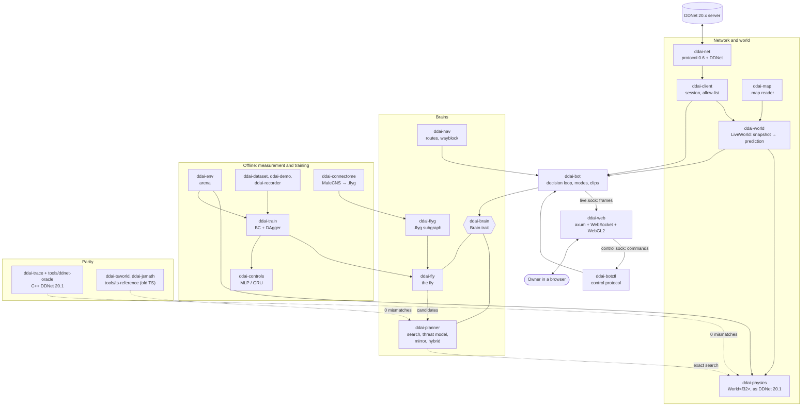

> **Modified version.** This is a fork of [Wranked1/DDNet-AI](https://github.com/Wranked1/DDNet-AI) (author: Wranked1, GPL-3.0), rewritten in Rust: the bot, a web interface instead of the Electron window, and a neural network constrained by the Drosophila connectome ("the fly"). It is not Wranked1's original program. The old TypeScript version (Electron, `start.mjs`, `run.sh`) has been removed from the tree; it stays in the git history, the last commit that has it is `0311695`.

<div align="center">


# DDNet AI

**A bot that plays block in DDNet by itself, written in Rust**

It throws the hook, swings the hammer, puts opponents into freeze and keeps itself out of it.<br>
Bit-exact DDNet 20.1 physics, a hybrid planner with an opponent model,<br>
a "fly" brain built on the Drosophila connectome, and a web panel with a live map.

[](https://github.com/Evelynkaz/DDNet-AI/actions/workflows/ci.yml)
[](LICENSE)


[Русский](README.md) · **English**


<sub>The Game tab on a local server: the bot (yellow ring) against three sparring partners. The web UI is in Russian.</sub>

</div>

## What it is

**DDNet AI** plays the "block" mode of [DDNet](https://ddnet.org): it puts opponents into freeze and stays out of it itself.
It is one binary, `ddnet-ai` (a cargo workspace in `crates/*`), with no Node.js and no Electron:

- **Bit-exact physics.** `ddai-physics` is a port of the DDNet 20.1 server physics, checked against the real C++ code
  (0 mismatches over tens of millions of tee-ticks). The bot predicts the world forward on the same physics the server uses.
- **A hybrid brain.** A neural network ("the fly") quickly proposes candidates; exact search on the real physics verifies them and
  picks the move. The opponent is not assumed to "hold its input": a small search "from its seat" predicts its reply
  (the "mirror", the opponent model).
- **The fly.** A network whose shape is taken from the Drosophila brain connectome (MaleCNS v1.0): who is wired to whom and the synapse sign
  are frozen; the connection scales, biases and a decoder are trained, by behaviour cloning and DAgger from the planner.
- **A web panel** instead of the Electron window: the real DDNet map in WebGL2, live tees and chat, bot control, start and stop,
  a panel for the fly, a training viewer. Served behind Caddy with HTTPS and a password; works on a phone too.
- **Fair play first.** The bot never writes to the game chat by itself, does not evade kicks or bans, and plays only on allowed servers
  (see [Safety and fair play](#safety-and-fair-play)).

## Screenshots

All screenshots were taken on a **private DDNet 20.1 server of our own** (`127.0.0.1`, the map Copy Love Box): the bot `Muha` with the hybrid brain
and the fly against three scripted sparring partners, `Spar1` to `Spar3`. No other players or addresses appear. The page itself is in Russian.

<table>
  <tr>
    <td></td>
  </tr>
  <tr>
    <td><sub><b>Game, zoomed.</b> The bot is marked with a ring and a "BOT" badge, name plates have a constant size, the scoreboard (the "Табло" button or Tab) is open, and the chat lines are the ones the owner typed in the input under the chat panel.</sub></td>
  </tr>
</table>

<table>
  <tr>
    <td width="33%"></td>
    <td width="33%"></td>
    <td width="33%"></td>
  </tr>
  <tr>
    <td><sub><b>Bot.</b> The "Запуск" (launch) card (server, brain, duration, sparring), the "Чат" (chat) card (a pointer to the input under the chat panel of the Game tab: the bot says only what the owner typed) and the bot state.</sub></td>
    <td><sub><b>Fly.</b> What the network sees and decides: the "eye" (a ray grid), the action, the activity of neuron groups. It shows whether the fly's proposal was played.</sub></td>
    <td><sub><b>Phone</b> (390×844). The same Game tab: the map, the event feed and the bot card.</sub></td>
  </tr>
</table>

<table>
  <tr>
    <td width="60%"></td>
    <td width="40%" valign="top"></td>
  </tr>
  <tr>
    <td><sub><b>Training.</b> Read-only: runs, loss and metric curves with the DAgger round markers, comparison of up to 4 runs. These are the E-005 runs.</sub></td>
    <td><sub><b>Status.</b> The login and state of the web page itself: the connection, the bot's state ("in game", "not running", …) and the uptime.</sub></td>
  </tr>
</table>

<sub>The decision time on the screenshots ("Решение p99", about 13 ms) was taken on a shared virtual machine that was running four bots, a server and a
browser with software WebGL at once, so under that load the wall-clock p99 goes past 5 ms; on a quiet machine it has not been measured (see "What is not proven yet"). The map and tee graphics are DDNet's, CC BY-SA 3.0 (see
[docs/img/README.md](docs/img/README.md) and [License](#license-and-credits)).</sub>

## Features

**The bot**
- Plays as an ordinary DDNet 20.x client: join, map, snapshots, input timing, reconnect "like the real client".
- Modes `fight` (default), `passive`, `hold`, `goto`; target selection, friend/war/ignore lists (`--relations`), `--target` to fight only one player.
- Navigation and the **wayblock** on Copy Love Box (the hall is found from the map's tiles), freeze memory keyed by the map's hash.
- Clips of the last 30 seconds and a bit-exact offline replay that names the first divergence (`ddnet-ai clip`).
- A 5 ms decision ceiling (D-042); the search can use several threads (`--search-threads`).
- **Finishing a block** (`--finish off|target|full`, D-097): with `target` the bot keeps a frozen victim as its target until the block is
  held, the victim is sealed or dead; a tee attacking the bot itself outranks the victim. Off by default, switched on from the site.
- Server pause: on `/spec` or `/pause` the bot stands still (no input, no `/kill`) and resumes after the repeated command.

**Brains** (`--brain`)
- `hybrid`: the live one. The fly proposes, exact search verifies, the "mirror" opponent model (`--hybrid-mirror on|off`).
- `planner`: an exact port of the old planner (the reference and the teacher of the fly); `fly`: the fly alone; `scripted`, `idle`, `circle`,
  `random-scripted`: auxiliary.

**The site** (`ddnet-ai web`)
- Tabs Status, Game, Bot, Fly, Training, Servers; dark theme, phone and desktop.
- Starting and stopping the bot from the site: the local server (sparring 0–3) or a favourite server, the brain, the duration, finishing.
  The site itself gets no privileges: a separate root helper validates everything (D-089).
- **Server browser** (D-099): the DDNet master list with search and filters, favourites, the owner's own proxies (write-only password),
  and "direct / via proxy" per server.
- Owner chat: a line typed on the site goes into the game chat, "/" commands included (D-094); nothing automatic.

**Measurement and training**
- **The arena** (`ddnet-ai arena`): offline N-player matches on the same physics, Wilson confidence intervals, paired seeds, the "credited wins"
  criterion (a win by the player's own block, D-059) and the **held block**: play goes on for 250 ticks after the freeze, and a block counts
  only if the victim did not get away (D-097).
- **Training** (`ddnet-ai train`): behaviour cloning and DAgger for the fly and for MLP/GRU controls with the same parameter count;
  a hand-written backward pass, deterministic results at any thread count. A bank of "the opponent was just frozen" starts, a held-block
  reward and evolution strategies (`train es`, D-098).
- **Human data**: a DDNet demo reader (`ddnet-ai demo`), an observer recorder (`ddnet-ai record`), a dataset tool (`ddnet-ai dataset`).

## How it works



**Bit-exact physics.** `ddai-physics` ports the character core and the server world of DDNet 20.1 (weapons, laser, draggers, turrets, switches, tune zones).
It is checked against two references built from the real DDNet code (`tools/ddnet-oracle`): "oracle A" is `gamecore`/`collision`, "oracle B" is the server code
(`CGameContext`/`CCharacter`) in one process without a network. From the server's snapshots `ddai-world` builds the same world and predicts it for the moment
our next input will arrive (including the inputs that are still in flight).

**The hybrid: "the fly proposes, exact search verifies" (D-041).** At each decision the fly proposes candidate plans in about 1 ms; the planner
(`ddai-planner`) runs them and its own by search on the predicted `World<f32>`, scores them under a 1vN threat model and picks one. The decision ceiling is 5 ms (D-042; work-clock p99 of 4.0–4.9 ms,
with an extension to 15 ms when danger is confirmed); without the fly (`--brain hybrid` with no `--fly-bundle`) the candidates come from the planner alone.

**The "mirror" opponent model (D-090, E-017).** The diagnosis of the hybrid's losses showed that in 60% of the "fixable" decisions the cause was the forecast of the
opponent's reply: "it holds its input" is wrong. Now a small search from the victim's seat (12 samples) predicts its next inputs and puts them into the
rollouts. The "duel only" rule turns the model off when another opponent is nearby, and "passive victim" turns it off when the opponent stands still.

**The held block (D-097, E-021).** A freeze is not yet a block: DDNet unfreezes after 3 s unless the victim lies on a freeze tile. The live
sessions showed the bot switching to another target within a second in 63% of its blocks. The arena now measures holding (250 ticks after the
freeze), and the target rule `--finish target` keeps a frozen victim until the block is held.

**Parity with the old TypeScript.** The Rust ports of the world, the planner and the navigation make the same decisions as Wranked1's original: the reference dumps
are made by the `tools/ts-trace` generators over the frozen sources in [`tools/ts-reference`](tools/ts-reference/README.md). This is what lets us compare "new" with "old" honestly.

**The fly.** A connectome subgraph (S: 2,717 neurons and 49.7k edges; M: 12,682 and 426k) is assembled deterministically into a `.flyg` file
(`ddai-connectome`). The eye is a ray grid on real visual projection neurons (VPN); the action is read by a decoder from descending neurons (DN).
More in [docs/FLY.md](docs/FLY.md) (in Russian).

## Results

Only what was measured and written in the log; the arena is offline, on the bot's physics, against the scripted bot and the **fixed planner**
(a port of the old TS planner). Live games are in a separate table below. "Credited wins" are wins by the player's own block (D-059); the 95%
Wilson interval is in brackets.

| What | Result | Where |
|---|---|---|
| Hybrid (without the fly) against the fixed planner, before and after the "mirror" (2,400 games, three halls, paired seeds) | **48.9% → 56.4%** [54.4; 58.4], McNemar p = 3·10⁻⁷ | [E-017](docs/EXPERIMENTS.md), §3 |
| The same on the reviewer's held-out set (1,200 games on untouched seeds) | **49.4% → 56.7%** [53.8; 59.4], p = 0.0004 | E-017, §8 |
| Hybrid against the scripted bot: Copy Love Box left / right / ChillBlock5 (400 games each) | 89.5% / 93.0% / 97.0% | [E-018](docs/EXPERIMENTS.md), §3 |
| Regressions: scripted and standing opponents (1,200 games); crowds and 1vN (800 games) | 95.0% → 95.7% (p = 0.29); 94.0% → 94.2% (p = 0.77) | E-017, §4 |
| Search work per decision, p99 (tee-ticks × 1.25 µs): 2 tees with the opponent model | 4.01 ms; 4.30 ms with the cost of the S fly; 4.91 ms with 4 tees (no model in a crowd) | E-017, §5 |
| Wayblock: a 468×255 copy of the Copy Love Box map on a private server (before the port the bot never entered the hall) | in the hall for 230 of 230 snapshots after entering | E-018, §2 |
| The hybrid against the competitor's planner `af49dfb` (v2), 1,200 games | 56.6% of decided games (p = 10⁻⁵); credited 53.5% [50.7; 56.3] | [E-020](docs/EXPERIMENTS.md), §4 |
| Against its "strong" 40×3 search (`v2-strong`), 1,650 games | 54.0% of decided [51.6; 56.5] (p = 0.0016); credited 51.2% [48.7; 53.6]: significant on decided games, not by the D-059 bar | E-020, §5 |
| Against its real live configuration (`v2live`): three samples (1,200, 1,200 and 330 games) | 56.1% / 53.3% / 49.0% of decided; credited 51.2% / 49.0% / 45.8%: by the D-059 bar we **do not win** | E-019, E-020 §5 |
| Held block in crowds (clb-left 1v3 / 1v5 / 8 players, 600 games): the target rule `hold_target` | held 259 → **342** (p < 10⁻⁴), credited first freezes 580 → 579 | [E-021](docs/EXPERIMENTS.md) |

**Live games** (DDNet servers with people; round score of the 1-on-1 F-DDrace mini-game; write-ups in `docs/research/`):

| Date | What | Result | Write-up |
|---|---|---|---|
| 7 Oct | Test duel against the competitor's bot (our machine loaded by builds) | lost 2:9 | [duel-2026-10-07](docs/research/duel-2026-10-07.md) |
| 8 Oct | Duel against a human player (machine loaded) | lost 9:10 | [duel-2026-10-08-human](docs/research/duel-2026-10-08-human.md) |
| 8 Oct | Two duels against the competitor bot's author (a human), «Дуэль» preset, quiet machine | **won both** | [STATUS](docs/STATUS.md) |
| 7 Oct | 15 minutes on a public DDNet block server (crowd, wayblock) | 64 blocks, 29 held; we were blocked 21 times | [preinput](docs/research/preinput.md) |

The main lesson so far: under machine load the bot evaluates half as many candidates and misses its input tick; on a
quiet machine with full finishing it wins (E-034, D-116, D-120).

| Parity and accuracy | Result | Where |
|---|---|---|
| Physics against C++ DDNet 20.1 (oracle A) | 0 mismatches over ≈ 57 million tee-ticks | [HISTORY](docs/HISTORY.md), 1.3 |
| Server world, stage A (oracle B) | 0 mismatches over 650 games of the corpus | HISTORY, 1.6 |
| Server world, stage B: laser, shotgun, draggers, turrets, light, ninja | 0 mismatches over 8.8 million ticks | HISTORY, 1.6b |
| Map reader against DDNet's own loader | 2,440 of 2,440 maps byte for byte | HISTORY, 1.4 |
| The old TS world (Rust port) against real Node | 0 mismatches over 1.56 million operation steps and 3 million steps on maps | HISTORY, 1.9 |
| Planner port against TS: decisions (teacher-forced, free games) | 19,360 and 3,604, 0 mismatches | E-017, §6 |
| Navigation and wayblock against TS `af49dfb` (five maps) | 0 mismatches | E-018, §1 |
| Forecast of our own tee from snapshots (BlockField, 8.6% late inputs) | 100% bit-exact 2 and 10 ticks ahead | HISTORY, 2.4 |

**What is not proven yet.**
- **The fly alone, without the planner, has not reached the F1/F2 targets**: direction and jump are learned, while the hook is held only if it is already out
  and it almost never starts or releases it (E-005, [HISTORY](docs/HISTORY.md) 8.2). In live play its role is candidates for the hybrid. The hybrid's edge over the
  planner in the table comes from the opponent model, not from the fly.
- The 5 ms p99 budget is measured on the work clock (tee-ticks), not on the wall clock of a quiet machine; the live bot's wall-clock p99 is not confirmed (3.7a, PARTIAL).
- There are only a few live duels so far (four, see the table above): too few for conclusions about strength against people.
- The learned opponent-input predictor adds no strength at the live 2-tick lag (E-036, D-118).
- Against the competitor's real live configuration (`v2live`) we do not win on credited wins; a clear edge exists only over its plain configuration.
- Finishing (`--finish target`) is measured in the arena; its effect against people is not measured.
- After freezing an opponent the fly holds the block poorly: on starts where the victim can get away, 0–3% against the planner's 84%; the ES pilot
  brought no gain (E-022). Reinforcement learning (PPO) is in progress.

## Quick start

You need Linux and Rust (the toolchain is pinned in `rust-toolchain.toml` and installed by `rustup`). Node.js is not needed for the bot or the site.

**1. Build.**

```bash
git clone https://github.com/Evelynkaz/DDNet-AI && cd DDNet-AI
cargo build --release --locked -p ddnet-ai          # -> target/release/ddnet-ai
target/release/ddnet-ai --help
```

**2. A local DDNet 20.1 server.** By default the bot plays only on a local server. Building the server and its config are described in
[docs/SETUP.md](docs/SETUP.md) §5c and [tools/ddnet-server/README.md](tools/ddnet-server/README.md) (in Russian; the server listens on `127.0.0.1:8303`).

**3. The bot.** Data (maps, clips, freeze memory, sockets) lives outside the repository, in the `--data-dir` directory (default `~/aiddnet/data`);
absolute paths are best.

```bash
D=$HOME/ddnet-ai-data
# the hybrid (planner + exact search) against the local server, no time limit
target/release/ddnet-ai play --server 127.0.0.1:8303 --brain hybrid --name Muha --duration 0 --data-dir "$D"
# the same with a trained fly as the proposer (weights are outside git; the `.flyg` graph is needed too: by default
# ~/aiddnet/data/connectome/compiled/fly-S-v1.flyg, produced by the pipeline in "Training the fly", or `--fly-flyg <file>`)
target/release/ddnet-ai play --server 127.0.0.1:8303 --brain hybrid --fly-bundle <file.bundle> [--fly-flyg <file.flyg>] --name Muha --duration 0 --data-dir "$D"
# a sparring partner (a scripted bot) for testing: run it in another terminal
target/release/ddnet-ai play --server 127.0.0.1:8303 --brain scripted --name Spar1 --duration 0 --clan Spar --no-bridge --no-control --no-memory --no-settings --no-autoclip --data-dir "$HOME/ddnet-ai-spar"
```

All flags: `ddnet-ai play --help`. Stop with Ctrl-C or SIGTERM. With `--web-names` the real nicknames of other players are visible only on the owner's
site (the default is salted tags); nicknames never reach the logs.

**4. The site.**

```bash
target/release/ddnet-ai web-passwd --data-dir "$D"           # a new random owner password
target/release/ddnet-ai web --listen 127.0.0.1:7788 --data-dir "$D" \
  --bot-socket "$D/bot/live.sock" --control-socket "$D/bot/control.sock" \
  --ddnet-data <the data/ directory of a DDNet 20.1 client>     # map and tee graphics
```

`web-passwd` writes the argon2id hash to `$D/secrets/web-auth.toml` and the password itself, in plain text, to `$D/secrets/web-password.txt` (0600): read it and
delete the file, and keep the `secrets/` directory out of backups. The `--show` flag prints the password to the terminal; do not use it in front of others or where it gets logged.

Open `http://127.0.0.1:7788`. The site listens on loopback only; Caddy puts it on the internet (HTTPS, `--trust-proxy --cookie-secure`).
The DDNet graphics (CC BY-SA 3.0) are not part of the repository: the site serves them from your local install (`--ddnet-data`) after login. Without them the map
and tees are drawn in a simplified way. Live maps are looked up in `<data-dir>/maps/cache`, where the bot puts the map it downloaded from the server.

**5. Starting the bot from the site.** The "Запуск" card on the Bot tab writes only a request file; a separate root unit, `ddnet-ai-launch`, validates it and starts the bot
(the site gets no privileges). Install with `deploy/install-launcher.sh`; details in [deploy/README.md](deploy/README.md) (in Russian), decision D-089.

**6. The arena (offline, no network).**

```bash
target/release/ddnet-ai arena list
target/release/ddnet-ai arena run --config configs/arena/dev-quick.toml --out /tmp/arena-test --games 20 --filter pit --threads 2
```

Arenas with real maps read the maps from `--map-dir` (default `~/aiddnet/data/maps`; they are not in git); the synthetic `pit` and `platform` need nothing.

### Training the fly

Data and weights live outside git (weights go to GitHub Releases when there are any). The pipeline: connectome → tables → `.flyg` subgraph → the planner's teaching games → BC + DAgger.

```bash
cargo run --release -p ddai-connectome -- fetch --manifest manifests/connectome.toml --dest ~/aiddnet/data/connectome/raw
cargo run --release -p ddai-connectome -- build-tables --raw ~/aiddnet/data/connectome/raw --out ~/aiddnet/data/connectome/tables
cargo run --release -p ddai-connectome -- build-subgraph --tables ~/aiddnet/data/connectome/tables/connectome.tables \
  --config configs/fly/S.toml --out ~/aiddnet/data/connectome/compiled/fly-S-v1.flyg --report ~/aiddnet/data/connectome/compiled/fly-S-v1.report.md
target/release/ddnet-ai train collect --config configs/train/round0-v1.toml
target/release/ddnet-ai train run     --config configs/train/e005-fly.toml
target/release/ddnet-ai train eval    --config configs/train/e005-fly.toml --bundle <checkpoint>
```

Configs are in `configs/train`, `configs/arena`, `configs/scenarios`, `configs/fly`; the experiment log is [docs/EXPERIMENTS.md](docs/EXPERIMENTS.md) (in Russian);
subgraph assembly and the `.flyg` format are in [crates/ddai-connectome/README.md](crates/ddai-connectome/README.md) and [crates/ddai-fly/README.md](crates/ddai-fly/README.md).

### Checks

```bash
cargo fmt --all --check
cargo clippy --workspace --all-targets --locked -- -D warnings
cargo test --workspace --locked
cargo deny check
tools/ci/no-weights.sh        # no weights, demos, maps or large files in git
```

Parity with TypeScript (needs Node >= 24 and `npm ci` in `tools/ts-reference`): tests with `--features ts-parity -- --ignored`; the commands are in
[crates/ddai-planner/README.md](crates/ddai-planner/README.md) and [crates/ddai-nav/README.md](crates/ddai-nav/README.md).

## Running on Windows

The bot builds and runs on Windows 10/11 (x86-64) and computes exactly what it computes on Linux: the physics math (`sinf`, `cosf`, `atanf`,
`atan2f`, `powf`, and in `double` `atan2` and `log`) is no longer taken from the operating system's C library but built into the bot as bit-exact
ports of glibc ([crates/ddai-libm](crates/ddai-libm/README.md), decision D-127). The CI job `windows` builds everything, runs clippy and the tests
on `windows-latest`, and among them hashes of results recorded on Linux with the real glibc must come out identical on Windows. This is what makes
it possible to run the client side from a home IP (D-016, D-047); the rules of play are the same as on Linux (allowed servers only, one bot, the
bot never writes in chat, a kick or ban means stop, no evasion).

**What works.** Everything in the quick start except launching through systemd: `play`, `record`, `arena`, `web`, `web-passwd`, `servers`, `clip`,
`map`, `dataset`, fly training, and so on. The bot stops on Ctrl-C or when the console window is closed.

**What is not there yet.** (1) The `launch` command and the site's launcher card: that is the root-side systemd helper of the VPS and builds on
Unix only. (2) The bot-to-site link (the live map and the bot controls on the site): it runs over Unix-domain sockets today, and how it works on
Windows is for task 5.5b to decide (together with packaging and an easy start). The site starts on Windows and listens on `127.0.0.1` only, but
shows "the bot is not connected"; the bot plays without it with `--no-bridge --no-control`.

**Building from source.** You need [rustup](https://rustup.rs/) (the Rust version is pinned in `rust-toolchain.toml`), the Visual Studio Build Tools
(the MSVC compiler, workload "Desktop development with C++") and Git; for the TLS library (`aws-lc-sys`) either NASM on `PATH` or the environment
variable `AWS_LC_SYS_PREBUILT_NASM=1`.

```powershell
git clone https://github.com/Evelynkaz/DDNet-AI; cd DDNet-AI
$env:AWS_LC_SYS_PREBUILT_NASM = "1"          # if NASM is not installed
cargo build --release --locked -p ddnet-ai   # -> target\release\ddnet-ai.exe
target\release\ddnet-ai.exe --help
```

A ready-made `.exe` in the releases and an easy start are task 5.5b (packaging); for now `ddnet-ai.exe` is built from source.

**Where the data lives.** `%USERPROFILE%\ddnet-ai\data` instead of `~/aiddnet/data` (maps, settings, freeze memory, clips, the site's secrets). Every
command takes another directory with `--data-dir`, and the environment variable `DDNET_AI_DATA_DIR` changes the default for all of them. Secrets
(`secrets\`, the `timeout-seed` file, the opponent lists) are created accessible to the current user only: the access-control list is set with the
system's `icacls`; if that fails the bot logs a warning and the file keeps the permissions of the profile folder.

**The site.**

```powershell
target\release\ddnet-ai.exe web-passwd --data-dir "$env:USERPROFILE\ddnet-ai\data"
target\release\ddnet-ai.exe web --listen 127.0.0.1:7788 --data-dir "$env:USERPROFILE\ddnet-ai\data"
```

The site listens on loopback (`127.0.0.1`) only; do not expose it. Open `http://127.0.0.1:7788`.

**The bot.**

```powershell
target\release\ddnet-ai.exe play --server 127.0.0.1:8303 --brain hybrid --name Muha --duration 0 --no-bridge --no-control
```

The rest (a local DDNet 20.1 server for tries, training) is as in the quick start; the DDNet server for Windows is built as DDNet's own instructions say.
To check on your machine that the numbers equal Linux's: `cargo test -p ddai-libm --test golden` and `cargo test -p ddai-physics`.

## Deployment

The production layout: `ddnet-ai-web` (the site on `127.0.0.1`) behind Caddy with HTTPS and a password, the bot as a separate systemd unit that never starts by itself
(`deploy/systemd/ddnet-ai-bot.service`), and a root helper for starting from the site. The bot unit is restricted at the cgroup level: by default it may use
loopback only. Installation and operation are in [deploy/README.md](deploy/README.md) (in Russian): `deploy/install.sh`, `deploy/install-launcher.sh`, changing the password, logs, rollback.

## Safety and fair play

These rules are written down as decisions ([docs/DECISIONS.md](docs/DECISIONS.md)) and backed by code and tests.

- **The bot never writes to the game chat by itself** (D-007). No auto-replies, no LLM, no periodic messages, no orders from the chat, no emotes; `/showall` was replaced by the
  protocol's own `Cl_ShowDistance` message. There are exactly two exceptions, both decided by the owner:
  - the fallback `/kill` (D-078) is the only text the bot may send on its own (a type with a single value, a byte-exact allow-list,
    only when the server silently dropped our `Cl_Kill`, at most once per 10 s);
  - a line the owner typed on the authenticated site, "/" commands included (D-094): the right to speak is a capability handed out once per process, plus a
    census test of call sites; at most one line per 3 s and ten per minute, a queue of at most three; DDNet's anti-bot trap line is refused; the switch
    `--no-owner-chat`.
- **We do not evade kicks or bans** (D-016). If kicked or banned the bot stops (exit code 3, the unit is not restarted), the case is written down and the owner decides.
  The server (and every port on its IP) stays closed until the owner presses «Открыть снова» himself (D-099). No changing of nicknames or addresses,
  no VPN or proxy to get around it.
- **Addresses in examples and tests are made up.** Examples, tests and fixtures name no third-party servers: they use documentation addresses (RFC 5737, 192.0.2.0/24 and the like), or a neutral example (`93.184.216.0/24`, the former example.com address, not a game server) where the check requires a public IP.
- **One bot per server**, at most 5 connections per 20 s to one server, at most two join attempts before entering the game (D-037, D-050, D-058).
- **The owner chooses the servers.** Before every connection the client checks the address: apart from the local one, a connection is possible only to a
  server in the owner's favourites (marked as "the admin allows the bot") or to an entry of `live-servers.toml` with `ready = true` (D-099); `--server auto`
  never picks a public server. By default the bot unit lets no traffic out beyond loopback at all.
- **Only the owner's own proxies, assigned by him to a specific server.** SOCKS5 with UDP (D-088) is never a way around a ban: after a ban the server is
  closed, and the bot cannot switch proxies by itself (D-053, D-099). Game packets go only to the proxy's address.
- **Privacy.** Other players are called salted tags in logs and reports; real nicknames appear only on the password-protected site (`--web-names`),
  in memory. The repository contains no other people's nicknames, demos, maps or weights.
- **The site.** Loopback only plus Caddy, argon2id password, server-side sessions, CSRF and Origin checks, login rate limits. Starting the bot is validated by a separate
  root program against closed lists of values (D-089).
- **Server rules.** The bot respects the rules of a given server; whether to chat there is the owner's call (D-094).

## Repository layout

| Path | What is there |
|---|---|
| `crates/ddnet-ai/` | the one binary: `play`, `web`, `arena`, `train`, `fly`, `clip`, `demo`, `dataset`, `record`, `rec`, `servers`, `proxy-check`, `launch`, `web-passwd`, `trace`, `map` |
| `crates/ddai-physics`, `ddai-map`, `ddai-world` | DDNet 20.1 physics, the map reader, the world predicted from snapshots |
| `crates/ddai-net`, `ddai-client` | the 0.6 + DDNet protocol, the client session and the allow-list |
| `crates/ddai-brain`, `ddai-planner`, `ddai-nav` | the brain interface, the planner and the hybrid, navigation and the wayblock |
| `crates/ddai-fly`, `ddai-flyg`, `ddai-connectome` | the fly: inference and training, the `.flyg` format, connectome subgraph assembly |
| `crates/ddai-bot`, `ddai-botctl`, `ddai-clip` | the live bot, the control protocol, clips |
| `crates/ddai-web` | the site: axum, WebSocket, a WebGL2 page |
| `crates/ddai-env`, `ddai-train`, `ddai-controls` | the arena, BC and DAgger training, MLP and GRU controls |
| `crates/ddai-demo`, `ddai-recorder`, `ddai-dataset` | DDNet demos, observer recording, the dataset |
| `crates/ddai-trace`, `ddai-tsworld`, `ddai-jsmath` | parity: traces, the Rust port of the old TS world, V8 math |
| `crates/ddai-libm`, `ddai-os` | cross-platform: bit-exact ports of glibc's math (the same numbers on Linux and Windows), the OS seam (data directories, secrets, sockets) |
| `configs/` | arenas, scenarios, training, the fly |
| `manifests/` | the pinned list of connectome files (sha256) |
| `deploy/` | Caddy, systemd, installation |
| `tools/` | parity oracles (C++ DDNet, V8), TS dump generators, e2e (Playwright), CI scripts |
| `tools/ts-reference/` | the frozen TS reference for parity (not a working bot) |
| `docs/` | plan, status, decisions, experiments, formats, research; `docs/img/` holds the screenshots |

## Documentation

Most of the documents are in Russian.

- [docs/STATUS.md](docs/STATUS.md): where we are and where to continue; [docs/HISTORY.md](docs/HISTORY.md): the task log; [docs/PLAN.md](docs/PLAN.md): phases, milestones, acceptance criteria.
- [docs/DECISIONS.md](docs/DECISIONS.md): the decision log (D-NNN); [docs/EXPERIMENTS.md](docs/EXPERIMENTS.md): the measurement log (E-NNN).
- [docs/FLY.md](docs/FLY.md): the fly and the connectome; [docs/ORIGINAL.md](docs/ORIGINAL.md): how the original is built.
- [docs/formats.md](docs/formats.md): data and protocol formats; [docs/SETUP.md](docs/SETUP.md): the environment and the local server.
- [deploy/README.md](deploy/README.md): deployment; each crate's README is in `crates/*/README.md`.

## License and credits

[GPL-3.0](LICENSE). The original project is [Wranked1/DDNet-AI](https://github.com/Wranked1/DDNet-AI), author Wranked1; this is a modified version
(section 7(b) in [NOTICE](NOTICE)). All rights and notices are in [NOTICE](NOTICE).

- **DDNet** (zlib): the physics and the drawing code are ported from DDNet 20.1 (Teeworlds (c) Magnus Auvinen, DDRace (c) Shereef Marzouk, DDNet (c) Dennis Felsing);
  the ported files carry the zlib notice and an "altered" mark. Other borrowings (V8/fdlibm, Lucide and Feather icons) are in [NOTICE](NOTICE).
- **DDNet graphics** (maps, tees, skins, HUD) are CC BY-SA 3.0, (c) DDNet and Teeworlds. The graphics files are **not part of
  the repository**: the site serves them from a local DDNet 20.1 install after login. The screenshots in `docs/img/` contain fragments of it and are
  distributed under CC BY-SA 3.0 (see [docs/img/README.md](docs/img/README.md)).
- **The connectome** is MaleCNS v1.0 (Janelia FlyEM and Google Research), CC-BY 4.0; Berg et al. (2026), *Sexual dimorphism in the complete Drosophila male
  central nervous system connectome*, Cell 189(18):5504-5526, [doi:10.1016/j.cell.2026.08.015](https://doi.org/10.1016/j.cell.2026.08.015).
  The data is **not part of the repository and is not redistributed**: the tool downloads it at a pinned version with a sha256 check ([`manifests/connectome.toml`](manifests/connectome.toml)).
  FlyWire is used only for local cross-checking.
- The network layer is written from the Teeworlds 0.6 + DDNet protocol; the comparison with libtw2 (MIT/Apache) is in tests only.
