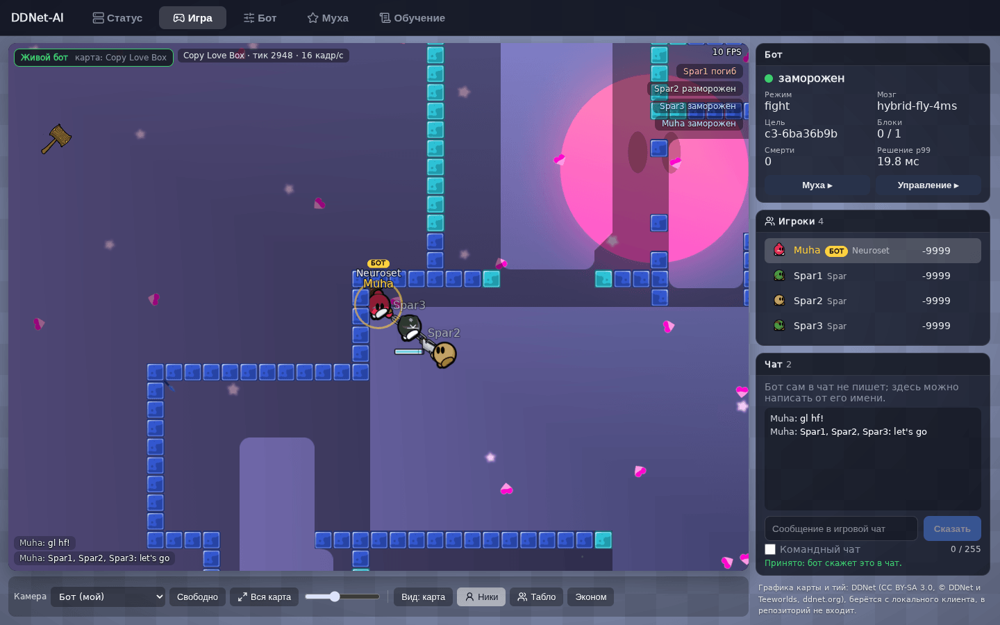
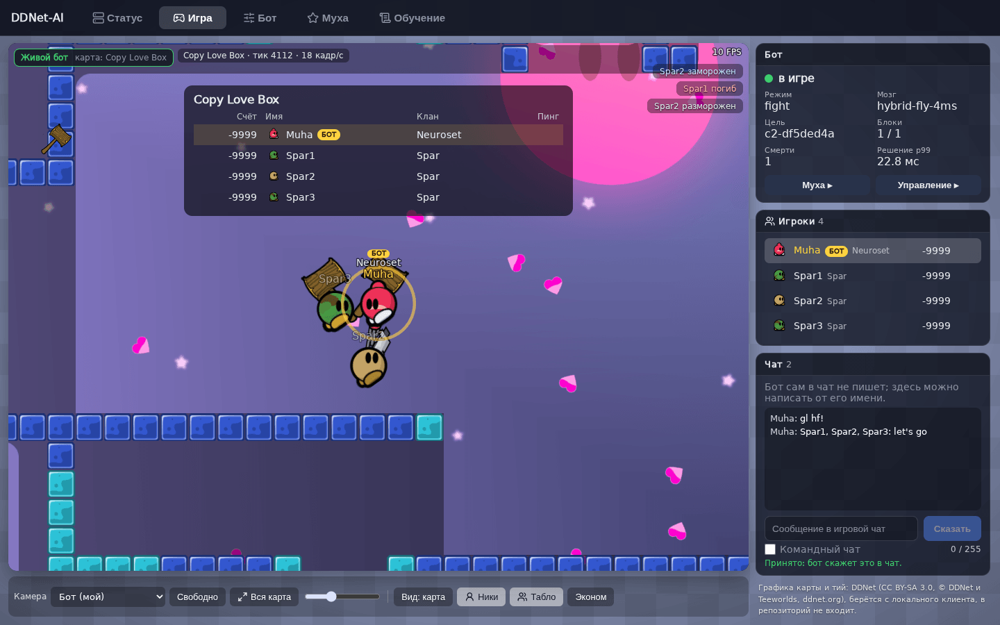
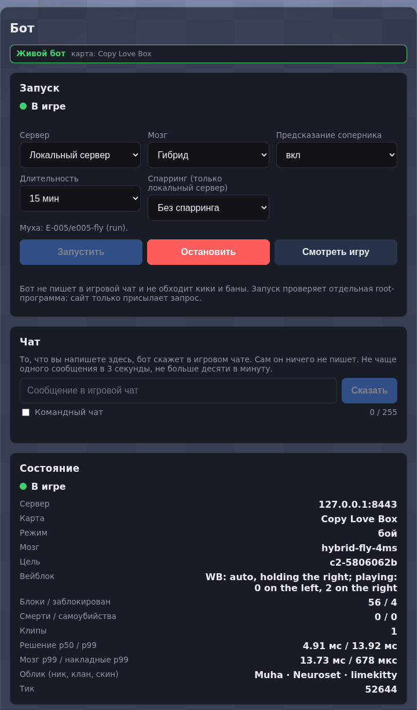
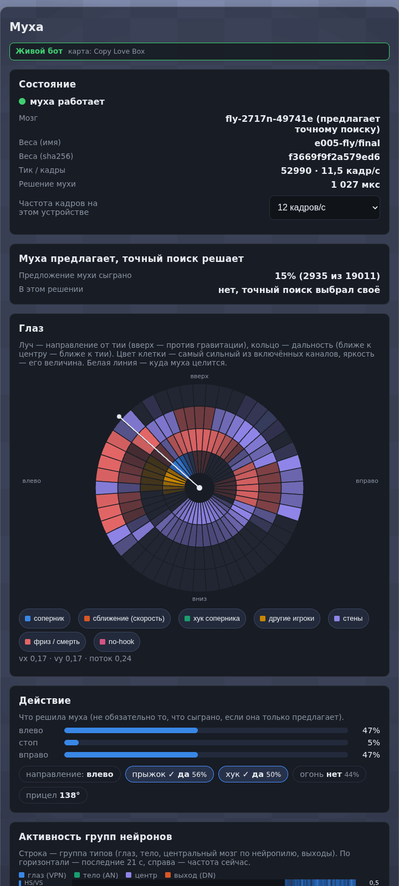
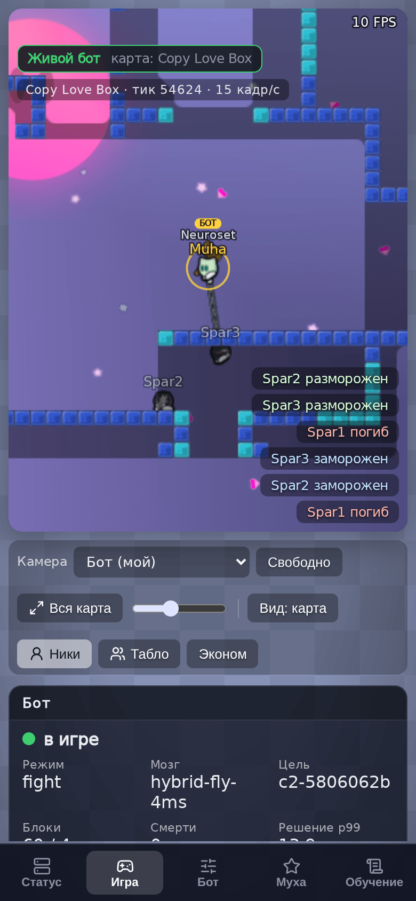
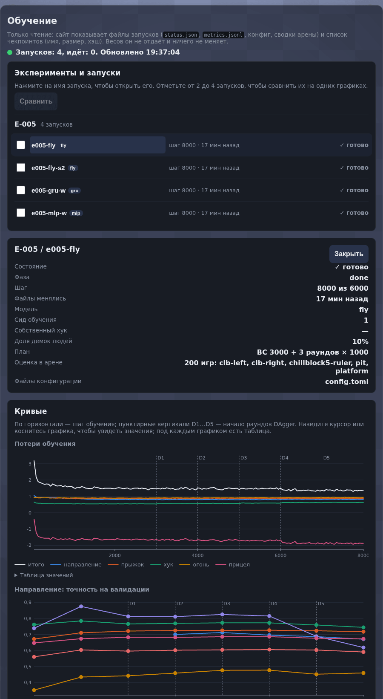
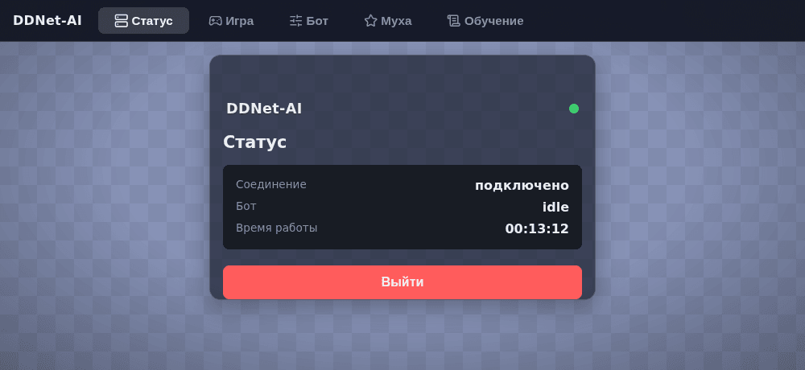
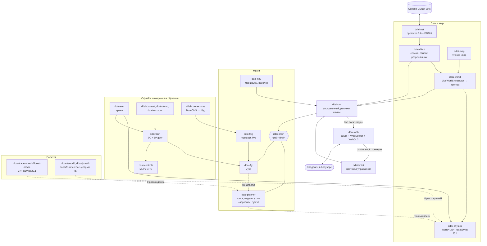

> **Изменённая версия.** Это форк [Wranked1/DDNet-AI](https://github.com/Wranked1/DDNet-AI) (автор — Wranked1, GPL-3.0), переписанный на Rust: бот, веб-интерфейс вместо Electron-окна и нейросеть на коннектоме дрозофилы («муха»). Это не оригинальная программа Wranked1. Старая TypeScript-версия (Electron, `start.mjs`, `run.sh`) удалена из дерева; она остаётся в истории git, последний коммит с ней — `0311695`.

<div align="center">


# DDNet AI

**Бот, который сам играет в блок в DDNet — на Rust**

Кидает хук, бьёт молотом, закидывает соперников во фриз и не попадает туда сам.<br>
Физика побитно как в DDNet 20.1, гибридный планировщик с моделью соперника,<br>
«муха» на коннектоме дрозофилы и веб-панель с живой картой.

[](https://github.com/Evelynkaz/DDNet-AI/actions/workflows/ci.yml)
[](LICENSE)


**Русский** · [English](README.en.md)



<sub>Вкладка «Игра» на локальном сервере: бот (жёлтое кольцо) против трёх спарринг-партнёров.</sub>

</div>

## Что это

**DDNet AI** играет в режиме «блок» в [DDNet](https://ddnet.org): ставит соперников под фриз и сам в него не попадает.
Это один бинарник `ddnet-ai` (cargo workspace из `crates/*`), без Node.js и без Electron:

- **Побитно верная физика.** `ddai-physics` — порт физики сервера DDNet 20.1, сверенный с настоящим C++-кодом
  (0 расхождений на десятках миллионов ти-тиков). Бот предсказывает мир вперёд на той же физике, по которой считает сервер.
- **Гибридный мозг.** Нейросеть («муха») быстро предлагает планы-кандидаты, а точный поиск на настоящей физике проверяет их и
  выбирает ход. Соперника он не считает «держащим ввод»: короткий поиск «с его места» предсказывает его ответ
  («зеркало», модель соперника).
- **«Муха».** Сеть, форма которой взята из коннектома мозга дрозофилы (MaleCNS v1.0): кто с кем связан и знак синапса
  заморожены, обучаются масштабы связей, смещения и декодер. Учится клонированием поведения и DAgger у планировщика.
- **Веб-панель** вместо Electron-окна: настоящая карта DDNet в WebGL2, живые тии и чат, управление ботом, запуск и остановка,
  панель «мухи», просмотр обучения. Работает за Caddy с HTTPS и паролем, с телефона тоже.
- **Честность прежде всего.** Бот сам не пишет в игровой чат, не обходит кики и баны, играет только на разрешённых серверах
  (см. [«Безопасность и честная игра»](#безопасность-и-честная-игра)).

## Скриншоты

Все снимки сделаны на **собственном закрытом сервере DDNet 20.1** (`127.0.0.1`, карта Copy Love Box): бот `Muha` с гибридным мозгом
и мухой против трёх скриптовых спарринг-партнёров `Spar1`…`Spar3`. Других игроков и адресов на них нет.

<table>
  <tr>
    <td></td>
  </tr>
  <tr>
    <td><sub><b>«Игра», крупно.</b> Бот выделен кольцом и плашкой «БОТ», ники постоянного размера, табло (кнопка «Табло» или Tab), в чате — строки, которые владелец набрал в поле ввода под панелью чата.</sub></td>
  </tr>
</table>

<table>
  <tr>
    <td width="33%"></td>
    <td width="33%"></td>
    <td width="33%"></td>
  </tr>
  <tr>
    <td><sub><b>«Бот».</b> Карточка «Запуск» (сервер, мозг, длительность, спарринг), карточка «Чат» (указатель на поле ввода под чатом вкладки «Игра»: бот говорит только то, что набрал владелец) и состояние бота.</sub></td>
    <td><sub><b>«Муха».</b> Что видит и решает сеть: «глаз» из лучевой сетки, действие, активность групп нейронов. Видно, сыграно ли её предложение.</sub></td>
    <td><sub><b>Телефон</b> (390×844). Та же вкладка «Игра»: карта, лента событий и карточка бота.</sub></td>
  </tr>
</table>

<table>
  <tr>
    <td width="60%"></td>
    <td width="40%" valign="top"></td>
  </tr>
  <tr>
    <td><sub><b>«Обучение».</b> Только чтение: запуски, кривые потерь и метрик с вертикалями раундов DAgger, сравнение до 4 запусков. Здесь — запуски E-005.</sub></td>
    <td><sub><b>«Статус».</b> Вход и состояние самой веб-страницы: соединение, состояние бота («в игре», «не запущен», …) и время работы.</sub></td>
  </tr>
</table>

<sub>Время решения на снимках («Решение p99» около 13 мс) снято на общей виртуальной машине, где одновременно шли четыре бота, сервер и
браузер с программным WebGL, так что под такой нагрузкой стенное p99 выходит за 5 мс; на тихой машине оно не измерено (см. «Что пока не доказано»). Графика карты и тий — DDNet, CC BY-SA 3.0 (см.
[docs/img/README.md](docs/img/README.md) и [«Лицензия»](#лицензия-и-авторы)).</sub>

## Возможности

**Бот**
- Играет как обычный клиент DDNet 20.x: вход, карта, снапшоты, тайминг ввода, переподключение «как у настоящего клиента».
- Режимы `fight` (по умолчанию), `passive`, `hold`, `goto`; выбор цели, друзья/враги/игнор (`--relations`), `--target` — бить только указанного игрока.
- Навигация и **вейблок** на Copy Love Box (зал определяется по тайлам карты), память о фризах по хэшу карты.
- Клипы последних 30 секунд и офлайн-воспроизведение бит в бит с причиной первого расхождения (`ddnet-ai clip`).
- Потолок решения 5 мс (D-042); поиск можно пустить в несколько потоков (`--search-threads`).
- **Дожим блока** (`--finish off|target|full`, D-097): в режиме `target` бот не бросает замороженную жертву, пока блок не удержан,
  жертва не запечатана или не погибла; нападающий на самого бота важнее жертвы. По умолчанию выключен, включается с сайта.
- Пауза сервера: на `/spec` или `/pause` бот стоит (никаких вводов и `/kill`), после повторной команды продолжает.

**Мозги** (`--brain`)
- `hybrid` — боевой: муха предлагает, точный поиск проверяет, модель соперника «зеркало» (`--hybrid-mirror on|off`).
- `planner` — точный порт старого планировщика (эталон, учитель мухи); `fly` — одна муха; `scripted`, `idle`, `circle`,
  `random-scripted` — служебные.

**Сайт** (`ddnet-ai web`)
- Вкладки «Статус», «Игра», «Бот», «Муха», «Обучение», «Серверы»; тёмная тема, телефон и десктоп.
- Запуск и остановка бота с сайта: локальный сервер (спарринг 0–3) или сервер из избранного, мозг, длительность, «Дожим».
  Сайт при этом прав не получает: всё проверяет отдельная root-программа (D-089).
- **Браузер серверов** (D-099): мастер-список DDNet с поиском и фильтрами, избранное, свои прокси владельца (пароль только на
  запись) и выбор «напрямую / через прокси» для каждого сервера.
- Чат владельца: строка, набранная на сайте, уходит в игровой чат, включая команды с «/» (D-094); ничего автоматического.

**Измерения и обучение**
- **Арена** (`ddnet-ai arena`): офлайн-матчи N игроков на той же физике, доверительные интервалы Вильсона, парные сиды, критерий
  «засчитанных побед» (победа собственным блоком, D-059) и **удержанный блок**: игра идёт ещё 250 тиков после заморозки, блок
  засчитывается, только если жертва не выбралась (D-097).
- **Обучение** (`ddnet-ai train`): клонирование поведения и DAgger для мухи и контролей MLP/GRU с тем же числом параметров;
  свой обратный проход, детерминированный результат при любом числе потоков. Банк стартов «соперник только что заморожен»,
  награда за удержанный блок и эволюционные стратегии (`train es`, D-098).
- **Данные людей**: чтец демок DDNet (`ddnet-ai demo`), наблюдатель-рекордер (`ddnet-ai record`), датасет (`ddnet-ai dataset`).

## Как это работает



**Побитно верная физика.** `ddai-physics` портирует ядро персонажа и серверный мир DDNet 20.1 (оружие, лазер, драггеры, турели, свитчи, tune-зоны).
Её сверяют с двумя эталонами на настоящем коде DDNet (`tools/ddnet-oracle`): «оракул A» — `gamecore`/`collision`, «оракул B» — серверный код
(`CGameContext`/`CCharacter`) в одном процессе без сети. `ddai-world` по снапшотам сервера строит такой же мир и предсказывает его на момент,
в который дойдёт наш следующий ввод (с учётом ввода, который ещё в пути).

**Гибрид: «муха предлагает, точный поиск проверяет» (D-041).** На каждом решении муха за ~1 мс предлагает планы-кандидаты; планировщик
(`ddai-planner`) прогоняет их и свои, перебором на прогнозе `World<f32>`, оценивает под моделью угроз 1vN и выбирает. Потолок решения — 5 мс (D-042; p99 на часах работы 4,0–4,9 мс,
при подтверждённой опасности — расширение до 15 мс); без мухи (`--brain hybrid` без `--fly-bundle`) кандидаты даёт только планировщик.

**Модель соперника «зеркало» (D-090, E-017).** Диагноз проигрышей гибрида показал, что в 60% «чинимых» решений причина — прогноз ответа
соперника: «он держит ввод» неверен. Теперь маленький поиск из места жертвы (12 выборок) предсказывает её следующие вводы и подставляет их в
роллауты. Правило «только дуэль» отключает модель, когда рядом другой соперник, а «пассивная жертва» — когда соперник стоит.

**Удержанный блок (D-097, E-021).** Заморозка — ещё не блок: DDNet размораживает через 3 с, если жертва не на тайле фриза.
Разбор живых сессий показал, что бот в 63% случаев уже через секунду переключался на другую цель. Арена теперь меряет удержание
(250 тиков после заморозки), а правило цели `--finish target` держит замороженную жертву, пока блок не удержан.

**Паритет со старым TypeScript.** Rust-порты мира, планировщика и навигации принимают те же решения, что оригинал Wranked1: эталонные дампы
делают генераторы `tools/ts-trace` над замороженными исходниками [`tools/ts-reference`](tools/ts-reference/README.md). Это основа, по которой
честно сравнивать «новое» со «старым».

**Муха.** Подграф коннектома (S: 2 717 нейронов и 49,7 тыс. рёбер; M: 12 682 и 426 тыс.) собирается детерминированно в файл `.flyg`
(`ddai-connectome`). Глаз — лучевая сетка на реальных зрительных нейронах (VPN), действие читает декодер из нисходящих нейронов (DN).
Подробнее — [docs/FLY.md](docs/FLY.md).

## Результаты

Только измеренное и записанное в журнале; арена — офлайн, на физике бота, против скриптового бота и **фиксированного планировщика**
(порт старого TS-планировщика). Живые игры — в отдельной таблице ниже. «Засчитанные победы» — победа собственным блоком (D-059), в скобках
95% интервал Вильсона.

| Что | Результат | Где |
|---|---|---|
| Гибрид (без мухи) против фиксированного планировщика, до и после «зеркала» (2 400 игр, три зала, парные сиды) | **48,9% → 56,4%** [54,4; 58,4], McNemar p = 3·10⁻⁷ | [E-017](docs/EXPERIMENTS.md), §3 |
| То же на отложенной выборке ревьюера (1 200 игр на нетронутых сидах) | **49,4% → 56,7%** [53,8; 59,4], p = 0,0004 | E-017, §8 |
| Гибрид против скриптового бота: Copy Love Box слева / справа / ChillBlock5 (по 400 игр) | 89,5% / 93,0% / 97,0% | [E-018](docs/EXPERIMENTS.md), §3 |
| Регрессии: скриптовый и стоячий соперники (1 200 игр); толпы и 1vN (800 игр) | 95,0% → 95,7% (p = 0,29); 94,0% → 94,2% (p = 0,77) | E-017, §4 |
| Работа поиска за решение, p99 (ти-тики × 1,25 мкс): 2 тия, с моделью соперника | 4,01 мс; 4,30 мс с ценой мухи S; 4,91 мс при 4 тиях (в толпе модель не работает) | E-017, §5 |
| Вейблок: копия карты Copy Love Box 468×255 на частном сервере (до порта бот в зал не входил) | в зале 230 из 230 снимков после входа | E-018, §2 |
| Гибрид против планировщика конкурента `af49dfb` (v2), 1 200 игр | 56,6% решённых игр (p = 10⁻⁵); засчитанные 53,5% [50,7; 56,3] | [E-020](docs/EXPERIMENTS.md), §4 |
| Против его «сильного» поиска 40×3 (`v2-strong`), 1 650 игр | 54,0% решённых [51,6; 56,5] (p = 0,0016); засчитанные 51,2% [48,7; 53,6] — значимо в решённых играх, но не по планке D-059 | E-020, §5 |
| Против его настоящей живой настройки (`v2live`): три выборки (1 200, 1 200 и 330 игр) | 56,1% / 53,3% / 49,0% решённых; засчитанные 51,2% / 49,0% / 45,8% — по планке D-059 **не выигрываем** | E-019, E-020 §5 |
| Удержанный блок в толпе (clb-left 1v3 / 1v5 / 8 игроков, 600 игр): правило цели `hold_target` | удержанных 259 → **342** (p < 10⁻⁴), засчитанные первые заморозки 580 → 579 | [E-021](docs/EXPERIMENTS.md) |

**Живые игры** (сервера DDNet с людьми; счёт раундов 1 на 1 в мини-игре F-DDrace; разборы — в `docs/research/`):

| Дата | Что | Итог | Разбор |
|---|---|---|---|
| 07.10 | Тестовая дуэль против бота конкурента (машина бота загружена сборками) | проигрыш 2:9 | [duel-2026-10-07](docs/research/duel-2026-10-07.md) |
| 08.10 | Дуэль против игрока-человека (машина загружена) | проигрыш 9:10 | [duel-2026-10-08-human](docs/research/duel-2026-10-08-human.md) |
| 08.10 | Две дуэли против автора бота-конкурента (человек), кнопка «Дуэль», тихая машина | **обе выиграны** | [STATUS](docs/STATUS.md) |
| 07.10 | 15 минут на публичном блок-сервере DDNet (толпа, вейблок) | 64 блока, 29 удержаны, нас заблокировали 21 раз | [preinput](docs/research/preinput.md) |

Главный урок живых игр: под нагрузкой машины бот успевает вдвое меньше и опаздывает к тику; на тихой машине и с
«Дожимом: полным» он выигрывает (E-034, D-116, D-120).

| Паритет и точность | Результат | Где |
|---|---|---|
| Физика против C++ DDNet 20.1 (оракул A) | 0 расхождений на ≈ 57 млн ти-тиков | [HISTORY](docs/HISTORY.md), 1.3 |
| Мир сервера, стадия A (оракул B) | 0 расхождений на 650 играх корпуса | HISTORY, 1.6 |
| Мир сервера, стадия B: лазер, дробовик, драггеры, турели, свет, ниндзя | 0 расхождений на 8,8 млн тиков | HISTORY, 1.6b |
| Читатель карт против загрузчика DDNet | 2 440 из 2 440 карт побайтно | HISTORY, 1.4 |
| Мир старого TS (Rust-порт) против настоящего Node | 0 расхождений на 1,56 млн шагов операций и 3 млн шагов на картах | HISTORY, 1.9 |
| Порт планировщика против TS: решения (учитель подсказывает, свободные игры) | 19 360 и 3 604, 0 расхождений | E-017, §6 |
| Навигация и вейблок против TS `af49dfb` (пять карт) | 0 расхождений | E-018, §1 |
| Прогноз своего тия по снапшотам (BlockField, 8,6% опоздавших вводов) | 100% побитно на 2 и 10 тиков вперёд | HISTORY, 2.4 |

**Что пока не доказано.**
- **Муха одна, без планировщика, цели F1/F2 не достигла**: направление и прыжок учатся, хук она держит, только если он уже выпущен, и почти
  никогда не начинает и не отпускает его (E-005, [HISTORY](docs/HISTORY.md) 8.2). В бою её роль — кандидаты для гибрида. Преимущество гибрида над
  планировщиком в таблице даёт модель соперника, а не муха.
- p99 бюджета 5 мс измерен по часам работы (ти-тики), а не по стенным часам тихой машины; p99 живого бота на стенных часах не подтверждён (3.7a, PARTIAL).
- Живых дуэлей пока немного (четыре дуэли, см. таблицу выше) — для выводов о силе против людей этого мало.
- Предсказатель ввода соперника (нейросеть) при живом лаге в 2 тика силы не добавляет (E-036, D-118).
- Против настоящей живой настройки конкурента (`v2live`) по засчитанным победам не выигрываем; уверенный перевес — только над его обычной настройкой.
- Дожим (`--finish target`) измерен в арене; эффект против людей не измерен.
- Муха после заморозки соперника держит блок плохо: на стартах, где жертва может уйти, 0–3% против 84% у планировщика; пилот ES — без
  улучшения (E-022). Идёт обучение с подкреплением (PPO).

## Быстрый старт

Нужны Linux (Windows — раздел «Запуск на Windows» ниже) и Rust (версия закреплена в `rust-toolchain.toml`, ставится через `rustup`). Node.js для бота и сайта не нужен.

**1. Сборка.**

```bash
git clone https://github.com/Evelynkaz/DDNet-AI && cd DDNet-AI
cargo build --release --locked -p ddnet-ai          # → target/release/ddnet-ai
target/release/ddnet-ai --help
```

**2. Локальный сервер DDNet 20.1.** Бот по умолчанию играет только на локальном сервере. Сборка сервера и конфиг — в
[docs/SETUP.md](docs/SETUP.md) §5c и [tools/ddnet-server/README.md](tools/ddnet-server/README.md) (сервер слушает `127.0.0.1:8303`).

**3. Бот.** Данные (карты, клипы, память о фризах, сокеты) лежат вне репозитория, в каталоге `--data-dir` (по умолчанию `~/aiddnet/data`);
пути лучше задавать абсолютные.

```bash
D=$HOME/ddnet-ai-data
# гибрид (планировщик + точный поиск) против локального сервера, без ограничения по времени
target/release/ddnet-ai play --server 127.0.0.1:8303 --brain hybrid --name Muha --duration 0 --data-dir "$D"
# то же с обученной мухой в роли подсказчика (веса вне git; нужен и граф `.flyg` — по умолчанию
# ~/aiddnet/data/connectome/compiled/fly-S-v1.flyg, его даёт конвейер из «Обучения мухи» — или `--fly-flyg <файл>`)
target/release/ddnet-ai play --server 127.0.0.1:8303 --brain hybrid --fly-bundle <файл.bundle> [--fly-flyg <файл.flyg>] --name Muha --duration 0 --data-dir "$D"
# спарринг-партнёр (скриптовый бот) для проверки: запускать в другой консоли
target/release/ddnet-ai play --server 127.0.0.1:8303 --brain scripted --name Spar1 --duration 0 --clan Spar --no-bridge --no-control --no-memory --no-settings --no-autoclip --data-dir "$HOME/ddnet-ai-spar"
```

Полный перечень флагов — `ddnet-ai play --help`. Остановка — Ctrl-C или SIGTERM. С `--web-names` настоящие ники других игроков видит только
сайт владельца (по умолчанию — солёные теги); в журналы ники не попадают.

**4. Сайт.**

```bash
target/release/ddnet-ai web-passwd --data-dir "$D"           # новый случайный пароль владельца
target/release/ddnet-ai web --listen 127.0.0.1:7788 --data-dir "$D" \
  --bot-socket "$D/bot/live.sock" --control-socket "$D/bot/control.sock" \
  --ddnet-data <каталог data/ клиента DDNet 20.1>               # графика карты и тий
```

`web-passwd` пишет хэш argon2id в `$D/secrets/web-auth.toml`, а сам пароль открытым текстом — в `$D/secrets/web-password.txt` (0600): прочтите его и
удалите файл, не копируйте каталог `secrets/` в резервные копии. Флаг `--show` печатает пароль в терминал — не используйте его при посторонних и в журналах.

Откройте `http://127.0.0.1:7788`. Сайт слушает только loopback; в интернет его выставляет Caddy (HTTPS, `--trust-proxy --cookie-secure`).
Графика DDNet (CC BY-SA 3.0) в репозиторий не входит: сайт отдаёт её с вашей локальной установки (`--ddnet-data`) уже после входа. Без неё карта
и тии рисуются упрощённо. Живые карты ищутся в `<data-dir>/maps/cache`, куда бот кладёт карту, скачанную с сервера.

**5. Запуск бота с сайта.** Карточка «Запуск» на вкладке «Бот» пишет только файл запроса; проверяет его и запускает бота отдельный
root-юнит `ddnet-ai-launch` (сайт прав не получает). Установка — `deploy/install-launcher.sh`, подробности — [deploy/README.md](deploy/README.md), решение D-089.

**6. Арена (офлайн, сеть не нужна).**

```bash
target/release/ddnet-ai arena list
target/release/ddnet-ai arena run --config configs/arena/dev-quick.toml --out /tmp/arena-test --games 20 --filter pit --threads 2
```

Арены с настоящими картами берут карты из `--map-dir` (по умолчанию `~/aiddnet/data/maps`; в git их нет); синтетические `pit` и `platform` ничего не требуют.

### Обучение мухи

Данные и веса — вне git (веса — в GitHub Releases, когда будут). Конвейер: коннектом → таблицы → подграф `.flyg` → учебные партии планировщика → BC + DAgger.

```bash
cargo run --release -p ddai-connectome -- fetch --manifest manifests/connectome.toml --dest ~/aiddnet/data/connectome/raw
cargo run --release -p ddai-connectome -- build-tables --raw ~/aiddnet/data/connectome/raw --out ~/aiddnet/data/connectome/tables
cargo run --release -p ddai-connectome -- build-subgraph --tables ~/aiddnet/data/connectome/tables/connectome.tables \
  --config configs/fly/S.toml --out ~/aiddnet/data/connectome/compiled/fly-S-v1.flyg --report ~/aiddnet/data/connectome/compiled/fly-S-v1.report.md
target/release/ddnet-ai train collect --config configs/train/round0-v1.toml
target/release/ddnet-ai train run     --config configs/train/e005-fly.toml
target/release/ddnet-ai train eval    --config configs/train/e005-fly.toml --bundle <чекпоинт>
```

Конфиги — `configs/train`, `configs/arena`, `configs/scenarios`, `configs/fly`; журнал опытов — [docs/EXPERIMENTS.md](docs/EXPERIMENTS.md);
сборка подграфа и формат `.flyg` — [crates/ddai-connectome/README.md](crates/ddai-connectome/README.md), [crates/ddai-fly/README.md](crates/ddai-fly/README.md).

### Проверки

```bash
cargo fmt --all --check
cargo clippy --workspace --all-targets --locked -- -D warnings
cargo test --workspace --locked
cargo deny check
tools/ci/no-weights.sh        # в git нет весов, демок, карт и больших файлов
```

Паритет с TypeScript (нужен Node ≥ 24 и `npm ci` в `tools/ts-reference`): тесты с `--features ts-parity -- --ignored`, команды — в
[crates/ddai-planner/README.md](crates/ddai-planner/README.md) и [crates/ddai-nav/README.md](crates/ddai-nav/README.md).

## Запуск на Windows

Бот собирается и работает на Windows 10/11 (x86-64). Физика и планировщик (прогноз мира, точный поиск, расстояния) считают те же числа, что на Linux и что сервер DDNet: математика физики (`sinf`, `cosf`, `atanf`, `atan2f`,
`powf` и в `double` `atan2`, `log`) больше не берётся из C-библиотеки системы, а вшита в бота как побитно точные порты glibc
([crates/ddai-libm](crates/ddai-libm/README.md), решение D-127). Задача `windows` в CI собирает всё, гоняет clippy и тесты на `windows-latest`, и
среди них хэши результатов, записанные на Linux с настоящей glibc, должны совпасть на Windows бит в бит. Это нужно, чтобы клиентскую часть можно
было запускать с домашнего IP (D-016, D-047): правила игры те же, что на Linux (только разрешённые серверы, один бот, бот сам не пишет в чат,
кик или бан — стоп без обхода).

**Что работает.** Всё из «Быстрого старта», кроме запуска через systemd: `play`, `record`, `arena`, `web`, `web-passwd`, `servers`, `clip`, `map`,
`dataset`, обучение мухи и т. д. Бот останавливается по Ctrl-C или закрытием окна консоли.

**Оговорки.** (а) Сети мухи (`--brain fly`, `--fly-bundle`: `ddai-fly`) считают `exp`, `tanh`, `ln` и родственные функции средствами системы, поэтому на Windows её предложения могут отличаться от Linux в последних битах и решения гибрида иногда другими; на точность физики и поиска это не влияет, но «точно то же, что на Linux» для мухи пока не обещано. (б) Перед игрой бот проверяет, что математика даёт нужные биты (в том числе встроенное «умножение с накоплением» `fma`: на Windows и на процессоре без FMA бот берёт своё, потому что `fma` системной библиотеки Windows не проверен: сознательный запас надёжности ценой ≈ 7 % скорости физики), и отказывается играть, если проверка не прошла. (в) Секреты (`secrets/`, семя `/timeout`) на Windows защищены ACL «только вы»; если это не удалось, а каталог данных не в вашей папке профиля, бот отказывается их писать (`DDNET_AI_ALLOW_UNRESTRICTED=1` принимает риск).

**Чего пока нет.** (1) Команды `launch` и карточки «Запуск» на сайте: это корневой помощник systemd на VPS, он собирается только под Unix.
(2) Связи «бот → сайт» (живая карта игры и управление ботом с сайта): сейчас она идёт по сокетам Unix, а как её сделать на Windows, решает
задача 5.5b (там же упаковка и простой запуск). Сайт на Windows запускается и слушает только `127.0.0.1`, но «бота нет на связи». Бот с флагами
`--no-bridge --no-control` играет без этого.

**Сборка из исходников.** Нужны [rustup](https://rustup.rs/) (версия Rust закреплена в `rust-toolchain.toml`), Visual Studio Build Tools
(компилятор MSVC, набор «Разработка классических приложений на C++») и Git; для TLS-библиотеки (`aws-lc-sys`) либо NASM в `PATH`, либо
переменная `AWS_LC_SYS_PREBUILT_NASM=1`.

```powershell
git clone https://github.com/Evelynkaz/DDNet-AI; cd DDNet-AI
$env:AWS_LC_SYS_PREBUILT_NASM = "1"          # если NASM не установлен
cargo build --release --locked -p ddnet-ai   # -> target\release\ddnet-ai.exe
target\release\ddnet-ai.exe --help
```

Готовый `ddnet-ai.exe` (с v0.2.0) — на странице [релизов](https://github.com/Evelynkaz/DDNet-AI/releases): он собран задачей CI `windows` на `windows-latest` после всех тестов. Упаковка и простой запуск — задача 5.5b.

**Где лежат данные.** Вместо `~/aiddnet/data` — `%USERPROFILE%\ddnet-ai\data` (карты, настройки, память о фризах, клипы, секреты сайта). Любая команда
берёт другой каталог через `--data-dir`, а переменная окружения `DDNET_AI_DATA_DIR` меняет умолчание сразу для всех. Секреты (`secrets\`, файл
`timeout-seed`, списки соперников) создаются доступными только текущему пользователю: список доступа (ACL) выставляется системной командой
`icacls`; если это не удалось, бот пишет предупреждение, и файл остаётся с правами папки профиля.

**Сайт.**

```powershell
target\release\ddnet-ai.exe web-passwd --data-dir "$env:USERPROFILE\ddnet-ai\data"
target\release\ddnet-ai.exe web --listen 127.0.0.1:7788 --data-dir "$env:USERPROFILE\ddnet-ai\data"
```

Сайт слушает только loopback (`127.0.0.1`), наружу его не выставляйте; откройте `http://127.0.0.1:7788`.

**Бот.**

```powershell
target\release\ddnet-ai.exe play --server 127.0.0.1:8303 --brain hybrid --name Muha --duration 0 --no-bridge --no-control
```

Остальное (локальный сервер DDNet 20.1 для проб, обучение) — как в «Быстром старте»; сервер DDNet для Windows собирается по инструкции самого DDNet.
Для проверки равенства с Linux на своей машине: `cargo test -p ddai-libm --test golden` и `cargo test -p ddai-physics`.

## Развёртывание

Боевая раскладка: `ddnet-ai-web` (сайт на `127.0.0.1`) за Caddy с HTTPS и паролем, бот отдельным systemd-юнитом, который сам не запускается
(`deploy/systemd/ddnet-ai-bot.service`), и root-помощник запуска с сайта. Юнит бота ограничен на уровне cgroup: по умолчанию ему разрешён
только loopback. Установка и эксплуатация — [deploy/README.md](deploy/README.md): `deploy/install.sh`, `deploy/install-launcher.sh`, смена пароля, журналы, откат.

## Безопасность и честная игра

Эти правила записаны в решениях ([docs/DECISIONS.md](docs/DECISIONS.md)) и подкреплены кодом и тестами.

- **Бот сам не пишет в игровой чат** (D-007). Нет автоответов, LLM, периодических сообщений, приказов из чата, эмоций; `/showall` заменён
  служебным сообщением протокола `Cl_ShowDistance`. Исключений три, все по решению владельца:
  - запасной `/kill` (D-078) — единственный текст в чате, который бот может послать сам (тип с одним значением, побайтовый список разрешённых,
    только когда сервер молча отбросил наш `Cl_Kill`, не чаще раза в 10 с);
  - строка, которую владелец сам набрал на авторизованном сайте, в том числе команда с «/» (D-094): право говорить — одна выдаваемая раз на процесс
    способность и проверка по исходникам; не чаще одной строки в 3 с и десяти в минуту, очередь не больше трёх; строка-ловушка анти-бота DDNet
    отвергается; выключатель `--no-owner-chat`;
  - стандартный код защиты от таймаута `/timeout <код>` один раз за вход в игру, как у официального клиента DDNet 20.1 (D-100): отдельная способность
    (тип, который умеет только эту команду, побайтовый список разрешённых), код выводится из случайного семени в каталоге данных и адреса сервера;
    чат владельца `/timeout` отвергает целиком.
- **Кики и баны не обходим** (D-016). Кикнули или забанили — бот останавливается (код выхода 3, юнит не перезапускается), случай записывается, решает владелец.
  Сервер (и все порты его IP) закрывается, пока владелец сам не нажмёт «Открыть снова» (D-099). Никаких смен ников и адресов, VPN и прокси ради обхода.
- **Адреса в примерах и тестах вымышленные.** Примеры, тесты и фикстуры не называют чужих серверов: там адреса для документации (RFC 5737, 192.0.2.0/24 и т. п.) или нейтральный пример (`93.184.216.0/24`, бывший адрес example.com, не игровой сервер) там, где проверка требует публичный IP.
- **Один бот на сервер**, не больше 5 подключений за 20 с к одному серверу, не больше двух попыток входа до входа в игру (D-037, D-050, D-058).
- **Серверы выбирает владелец.** Клиент перед каждым подключением проверяет адрес: кроме локального, подключение возможно только к серверу из
  избранного владельца (с отметкой, что администратор не против бота) или к записи `live-servers.toml` с `ready = true` (D-099); `--server auto`
  публичные серверы не выбирает. Юнит бота по умолчанию вообще не выпускает трафик за loopback.
- **Прокси — только свои, назначенные владельцем конкретному серверу.** SOCKS5 с UDP (D-088) никогда не служит обходом бана: после бана сервер закрыт,
  а сменить прокси автоматически бот не может (D-053, D-099). Игровые пакеты идут только на адрес прокси.
- **Приватность.** Другие игроки в журналах и отчётах называются солёными тегами; настоящие ники — только на закрытом паролем сайте (`--web-names`),
  в памяти. В репозитории нет чужих ников, демок, карт и весов.
- **Сайт.** Только loopback и Caddy, пароль argon2id, серверные сессии, CSRF и проверка Origin, лимиты входа. Запуск бота проверяет отдельная
  root-программа по закрытым спискам значений (D-089).
- **Правила серверов.** Бот уважает правила конкретного сервера; писать ли там в чат, решает владелец (D-094).

## Структура репозитория

| Путь | Что там |
|---|---|
| `crates/ddnet-ai/` | единственный бинарник: `play`, `web`, `arena`, `train`, `fly`, `clip`, `demo`, `dataset`, `record`, `rec`, `servers`, `servers-cache`, `proxy-check`, `launch`, `web-passwd`, `trace`, `map` |
| `crates/ddai-physics`, `ddai-map`, `ddai-world` | физика DDNet 20.1, чтение карт, предсказанный мир по снапшотам |
| `crates/ddai-net`, `ddai-client` | протокол 0.6 + DDNet, клиентская сессия и список разрешённых |
| `crates/ddai-brain`, `ddai-planner`, `ddai-nav` | интерфейс мозга, планировщик и гибрид, навигация и вейблок |
| `crates/ddai-fly`, `ddai-flyg`, `ddai-connectome` | муха: инференс и обучение, формат `.flyg`, сборка подграфа коннектома |
| `crates/ddai-bot`, `ddai-botctl`, `ddai-clip` | живой бот, протокол управления, клипы |
| `crates/ddai-web` | сайт: axum, WebSocket, страница на WebGL2 |
| `crates/ddai-env`, `ddai-train`, `ddai-controls` | арена, обучение BC и DAgger, контроли MLP и GRU |
| `crates/ddai-demo`, `ddai-recorder`, `ddai-dataset` | демки DDNet, запись наблюдателем, датасет |
| `crates/ddai-trace`, `ddai-tsworld`, `ddai-jsmath` | паритет: трассы, Rust-порт старого TS-мира, математика V8 |
| `crates/ddai-libm`, `ddai-os` | кроссплатформенность: побитно точные порты математики glibc (одни числа на Linux и Windows), шов ОС (каталоги данных, секреты, сокеты) |
| `configs/` | арены, сценарии, обучение, муха |
| `manifests/` | закреплённый список файлов коннектома (sha256) |
| `deploy/` | Caddy, systemd, установка |
| `tools/` | оракулы паритета (C++ DDNet, V8), генераторы TS-дампов, e2e (Playwright), CI-скрипты |
| `tools/ts-reference/` | замороженный TS-эталон для паритета (не рабочий бот) |
| `docs/` | план, статус, решения, эксперименты, форматы, исследования; `docs/img/` — скриншоты |

## Документация

- [docs/STATUS.md](docs/STATUS.md) — где мы сейчас и где продолжить; [docs/HISTORY.md](docs/HISTORY.md) — журнал задач; [docs/PLAN.md](docs/PLAN.md) — фазы, вехи, критерии приёмки.
- [docs/DECISIONS.md](docs/DECISIONS.md) — журнал решений (D-NNN); [docs/EXPERIMENTS.md](docs/EXPERIMENTS.md) — журнал измерений (E-NNN).
- [docs/FLY.md](docs/FLY.md) — муха и коннектом; [docs/ORIGINAL.md](docs/ORIGINAL.md) — как устроен оригинал.
- [docs/formats.md](docs/formats.md) — форматы данных и протоколов; [docs/SETUP.md](docs/SETUP.md) — окружение и локальный сервер.
- [deploy/README.md](deploy/README.md) — развёртывание; README каждого крейта — в `crates/*/README.md`.

## Лицензия и авторы

[GPL-3.0](LICENSE). Оригинальный проект — [Wranked1/DDNet-AI](https://github.com/Wranked1/DDNet-AI), автор Wranked1; это изменённая версия
(раздел 7(b) в [NOTICE](NOTICE)). Все права и уведомления — в [NOTICE](NOTICE).

- **DDNet** (zlib): физика и отрисовка портированы из DDNet 20.1 (Teeworlds © Magnus Auvinen, DDRace © Shereef Marzouk, DDNet © Dennis Felsing);
  в портированных файлах стоят уведомления zlib и пометка «изменено». Остальные заимствования (V8/fdlibm, иконки Lucide и Feather) — в [NOTICE](NOTICE).
- **Графика DDNet** (карты, тии, скины, HUD) — CC BY-SA 3.0, © DDNet и Teeworlds. Файлы графики **не входят в
  репозиторий**: сайт отдаёт их с локальной установки DDNet 20.1 после входа. Скриншоты в `docs/img/` содержат её фрагменты и
  распространяются по CC BY-SA 3.0 (см. [docs/img/README.md](docs/img/README.md)).
- **Коннектом** — MaleCNS v1.0 (Janelia FlyEM и Google Research), CC-BY 4.0; Berg et al. (2026), *Sexual dimorphism in the complete Drosophila male
  central nervous system connectome*, Cell 189(18):5504–5526, [doi:10.1016/j.cell.2026.08.015](https://doi.org/10.1016/j.cell.2026.08.015).
  Данные в репозиторий **не входят и не распространяются**: утилита скачивает их с закреплённой версией и проверкой sha256 ([`manifests/connectome.toml`](manifests/connectome.toml)).
  FlyWire используется только для локальной сверки.
- Сетевой слой написан по протоколу Teeworlds 0.6 + DDNet; сверка с libtw2 (MIT/Apache) — только в тестах.
